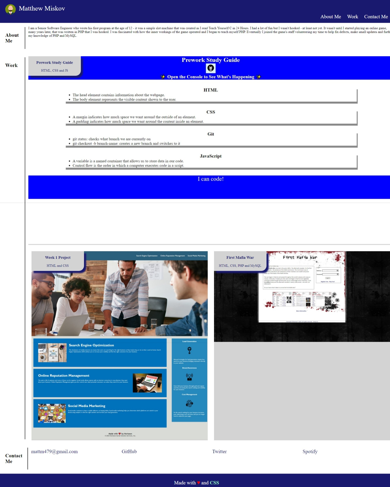

# My Portfolio

## Description

For this project, I made a responsive portfolio webpage that included information about me, my completed projects up to this point and my contact information.
I built this project to learn how to make a webpage responsive and how to build a webpage from scratch.
This project solves the problem of building a responsive portfolio webpage.
With this project, I learned how to make a webpage responsive and how to build a webpage from scratch.

## Usage

To use the webpage, please navigate to https://mattm479.github.io/my-portfolio. This webpage will look similar to the screenshot below:

## License

License can be found [here](LICENSE).